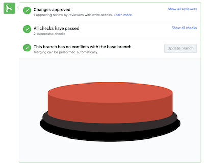

# It's a bird... it's a plane...

Merge your next PR with the biggest, most obnoxious merge button in the world. [Download that shit on the Chrome Webstore](https://chrome.google.com/webstore/detail/github-launch/pdjgcklkdjfceddnfdpajldnkcfacnih).

## How to use...

1. Install the Chrome extension
2. Go to a PR and click "Merge pull request"
3. 

_Note: this only merges PR's that have passed all checks. We ain't gonna promote no nonsense around here._
